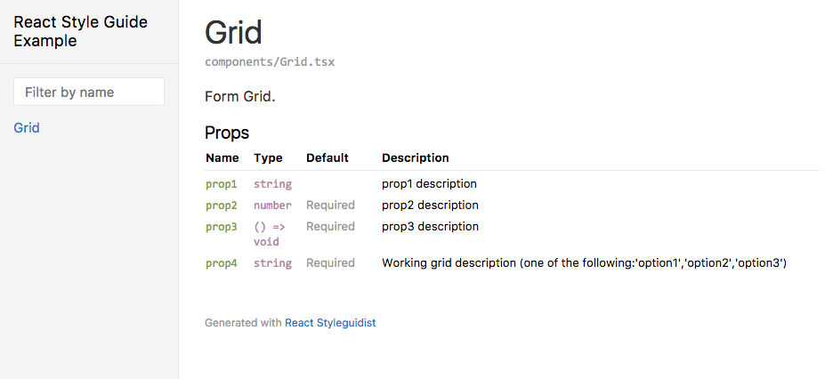

# react-docgen-typescript

[](https://travis-ci.org/styleguidist/react-docgen-typescript)


A simple parser for React properties defined in TypeScript instead of propTypes.

It can be used with [React Styleguidist](https://github.com/styleguidist/react-styleguidist).

## Installation

```
npm install --save-dev react-docgen-typescript
```

## React Styleguidist integration

Include following line in your `styleguide.config.js`:

```javascript
propsParser: require('react-docgen-typescript').withDefaultConfig([parserOptions]).parse
```

or if you want to use custom tsconfig file

```javascript
propsParser: require('react-docgen-typescript').withCustomConfig('./tsconfig.json', [parserOptions]).parse
```

### parserOptions

- propFilter:

  ```typescript
  {
    skipPropsWithName?: string[] | string;
    skipPropsWithoutDoc?: boolean;
  }
  ```

  or

  ```typescript
  (props: PropItem, component: Component) => boolean
  ```

  Note: `children` without a doc comment will not be documented.

## Example

In the example folder you can see React Styleguidist integration.

The component [`Column.tsx`](./examples/react-styleguidist-example/components/Column.tsx)

```javascript
import * as React from 'react';
import { Component } from 'react';

/**
 * Column properties.
 */
export interface IColumnProps {
    /** prop1 description */
    prop1?: string;
    /** prop2 description */
    prop2: number;
    /**
     * prop3 description
     */
    prop3: () => void;
    /** prop4 description */
    prop4: 'option1' | 'option2' | 'option3';
}

/**
 * Form column.
 */
export class Column extends Component<IColumnProps, {}> {
    render() {
        return <div>Test</div>;
    }
}
```

Will generate the following stylesheet:


The functional component [`Grid.tsx`](./examples/react-styleguidist-example/components/Grid.tsx)

```javascript
import * as React from 'react';

/**
 * Grid properties.
 */
export interface IGridProps {
    /** prop1 description */
    prop1?: string;
    /** prop2 description */
    prop2: number;
    /**
     * prop3 description
     */
    prop3: () => void;
    /** Working grid description */
    prop4: 'option1' | 'option2' | 'option3';
}

/**
 * Form Grid.
 */
export const Grid = (props: IGridProps) => {
    const smaller = () => {return;};
    return <div>Grid</div>;
};
```

Will generate the following stylesheet:



## Contributions
The typescript is pretty complex and there are many different way how
to define components and their props so it's realy hard to support all
diferent use cases. That means only one thing, contributions are highly
welcome. Just keep in mind that each PR should also include tests for
the part it's fixing.

## Thanks to contributors

**@argshook** *Arijus Šukys*

**@asilgag** *Alberto Silva*

**@basarat** *Basarat Ali Syed*

**@brettjurgens** *Brett Jurgens* - adding support for default props

**@chrisalbert** *Chris Albert*

**@diegolanda** *Diego* - support for different kinds of components

**@dotcs** *Fabian Mueller* - introduced parserOptions for skipping undocumented properties

**@eps1lon** *Sebastian Silbermann*

**@Havret** *Krzysztof Havret*

**@JakeSidSmith** *Jake*

**@JocD** *Jacques Dukes* - complete support for functional components and much more

**@jrwebdev** *James Ravenscroft*

**@kbukum** *Kamil BUKUM*

**@marionebl** *Mario Nebl*

**@milesj** *Miles Johnson*

**@RoystonS** *Royston Shufflebotham* - complete parser rewrite that use typescript parser in much better way and overcome many issues of previous implementation

**@yoiang** *Ian G*

**@sapegin** *Artem Sapegin* - fix for compatibility with react-styleguidist v5

**@skeate** *Jonathan Skeate*

## Thanks to others

The integration with React Styleguidist wouldn't be possible without [Vyacheslav Slinko](https://github.com/vslinko) pull request [#118](https://github.com/styleguidist/react-styleguidist/pull/118) at React Styleguidist.
